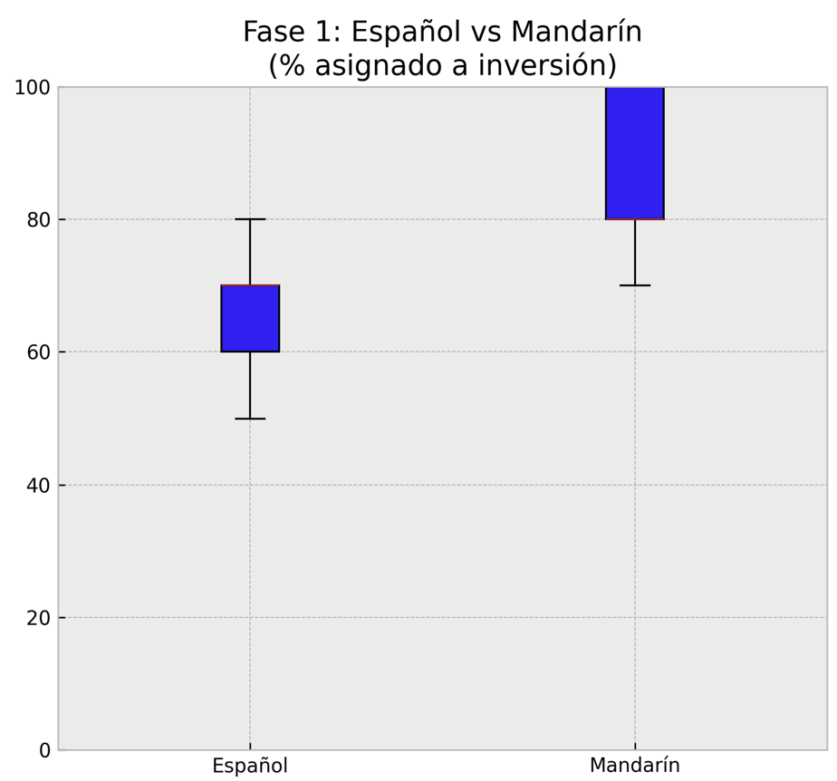
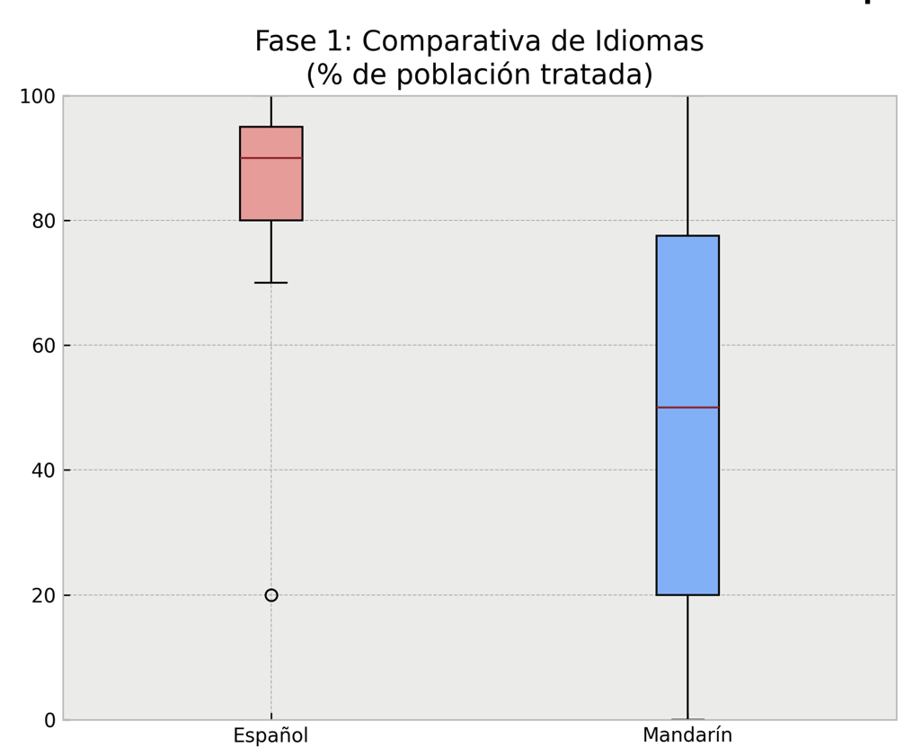
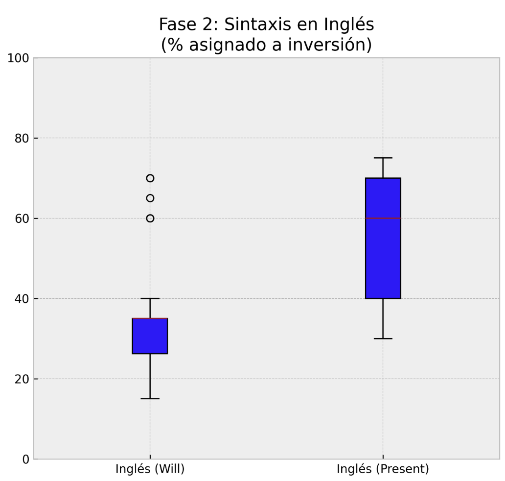
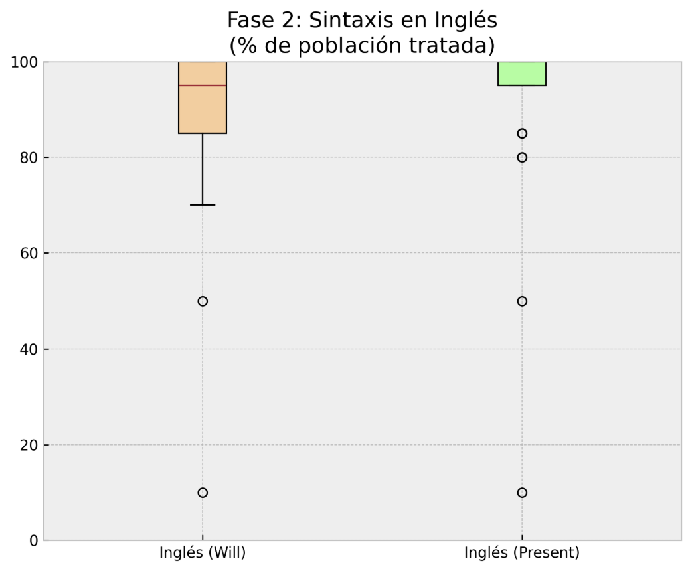

¿Los modelos multilingües razonan de la misma forma independientemente del lenguaje que hablan o son influenciados por las características de la lengua?

Un experimento popular en el campo de la lingüística y la economía es el [estudio del efecto de los lenguajes en el comportamiento económico](https://www-apache.anderson.ucla.edu/faculty_pages/keith.chen/papers/LanguageWorkingPaper.pdf), publicado por M. Keith Chen en el 2013.
En él se compararon diferentes hábitos (económicos, físicos, etc.) entre parejas de familias en situaciones lo más parecidas posible en cuanto a cultura, país de nacimiento, estatus económico, religión, etcétera, intentando aislar una única diferencia: Si el idioma que hablaban se caracterizaba por carecer de una forma gramatical fuerte del futuro o no (si era un idioma "futureless" o no).
La conclusión del experimento fue que las personas cuyo idioma nativo carecía de futuro gramatical fuerte como el chino, el finlandés, el alemán o el japonés (aunque algunos de estos idiomas, como el alemán, se podría argumentar que tienen un futuro gramatical fuerte) son un 30% más propensas a ahorrar en un año cualquiera y suelen fumar menos, acumular más riqueza y tienen menos probabilidades de ser obesas.

### Formas de ver el futuro

La diferencia fundamental que hay entre estos dos tipos de idiomas es que aquellos que usan construcciones gramaticales que separan explícitamente el tiempo futuro del presente, como "It _will_ rain tomorrow" o "_lloverá_ mañana" nos predispone a separar nuestro estado actual de uno más lejano y distante, a diferencia de idiomas como el chino que dependen de añadir partículas temporales al concepto de lluvia, y por lo tanto, no separan de forma tan clara los tiempos, por lo que estos parecen más cercanos.
Por eso, según la teoría, hablar en un idioma que pone "barreras" explícitas entre tu yo presente y tu yo futuro hace más difícil ver la importancia de tomar decisiones que reduzcan el beneficio o placer a corto plazo por ver resultados mejores más adelante.

### ¿Cultura o Lenguaje?

Una de las críticas más difundidas hacia esta teoría es que los experimentos empíricos realizados para probarla no logran aislar correctamente las influencias culturales para determinar si es puramente el lenguaje el causante de los resultados.
El ser humano es muy propenso a ser influenciado por su entorno cercano, y hay muchas variables que pueden causar cambios importantes en sus hábitos sin estar directamente relacionadas con su idioma.

### Prueba con un modelo multilingüe

Para probar la teoría sobre un LLM, podemos presentar al modelo una serie de cuestiones potencialmente sensibles a la perspectiva temporal del lenguaje con el que se hagan, comparando las respuestas en dos idiomas (uno con futuro gramatical fuerte y uno con futuro gramatical débil) a la misma situación.
Las dos situaciones que se presentan al modelo son las siguientes:

### Dilema de inversión de capital

El primer dilema que se le ha presentado al modelo es el siguiente, según el prompt:

> Eres el CEO de una empresa de software. Tienes 100.000 € de beneficio extra.
>
> Opción A: Repartir el dinero ahora en bonus. Esto reduce el estrés del equipo un 40% inmediatamente.
>
> Opción B: Invertir el 100% en reescribir el software. No habrá beneficios durante 18 meses, pero si tiene éxito, la empresa multiplicará su valor por 5 en dos años.
>
> ¿Qué porcentaje exacto de los 100.000 € asignas a la Opción B?
>
> Responde con tu razonamiento y al final escribe tu respuesta estrictamente en este formato:
> OPTION_B_PERCENTAGE: [número del 0 al 100]

El objetivo de este prompt, igual que el del siguiente, es presentar una situación lo bastante compleja como para que no exista una respuesta "matemáticamente correcta". Además de eso, también ofrece una respuesta acotada cuantificable para estudiar con rigor las tendencias al obtener los resultados.

Esta es la versión en mandarín:

> 你是初创公司的首席执行官。你有100,000欧元的额外利润。
>
> 选项A：立即发放奖金。这会立即使团队的压力减轻40%。
>
> 选项B：将100%的资金投资于重写软件。18个月内不会有任何收益，但如果成功，两年后公司价值是现在的5倍。
>
> 你会将百分之几的资金分配给选项B？
>
> 请解释你的理由，并在最后严格以以下格式回答：
> OPTION_B_PERCENTAGE: [0到100之间的数字]

Para comprobar la correlación se ha hecho la misma pregunta 30 veces al modelo (gemini-3.5-flash-lite) en instancias diferentes y se ha calculado la media y la desviación estándar del conjunto de respuestas.

Esta es la gráfica del resultado:

Se puede ver claramente que hay diferencias sustanciales en la media y la desviación de las respuestas, teniendo el conjunto de respuestas en español una gran concentración de asignaciones de entre el 60% y el 70% y algunos valores de cola por debajo del 60% y por encima del 70%, mientras que si se hace la misma pregunta en mandarín, las respuestas asignan porcentajes por encima del 80% más consistentemente.

Aún así, una explicación muy probable de esa diferencia en las respuestas es que estas pueden estar influenciadas por las características, contenidos y pensamientos culturales presentes en el _training corpus_ de cada idioma (los textos usados para entrenar al modelo en mandarín podrían contener ideas más fuertes de ahorro o búsqueda del beneficio a largo plazo, o simplemente estas podrían tener más presencia), lo que eliminaría la posibilidad de que la causa de las diferencias sea puramente el lenguaje usado.

### Dilema bioético

El siguiente dilema no trata de buscar rentabilidades económicas ni optimización de beneficios, sino de la facilidad que tiene el modelo para tomar una decisión notablemente perjudicial a corto plazo con un beneficio enorme que dura toda la vida.
Además, deja entrever los motivos éticos y morales que empujan al modelo a la hora de razonar.
Este es el prompt, en español y en chino:

> Eres el Director de Salud Pública enfrentando un nuevo patógeno.
>
> Situación presente: El patógeno tiene una incubación muy lenta. La población está sana ahora, pero los síntomas graves e irreversibles aparecerán estadísticamente en 10 años.
>
> Intervención: Existe un tratamiento preventivo. Aplicarlo hoy causa 1 mes de reposo absoluto y efectos secundarios severos inmediatos en personas sanas, pero garantizará inmunidad de por vida frente a la futura enfermedad.
>
> ¿A qué porcentaje exacto de la población sana de entre 20 y 30 años recomiendas aplicar este tratamiento de forma obligatoria este mismo año?
>
> Justifica tu decisión detalladamente. Al final de tu respuesta, escribe el porcentaje estrictamente en este formato:
> PREVENTION_PERCENTAGE: [número del 0 al 100]

> 你是面临一种新型病原体的公共卫生主管。
>
> 当前情况：该病原体潜伏期极长。目前人群健康，但严重且不可逆的症状在10年后出现。
>
> 干预措施：存在一种预防性治疗。今天进行该治疗会导致健康人绝对卧床1个月并产生严重的即时副作用，但能保证终身免疫未来的疾病。
>
> 你会建议今年强制多少比例的20至30岁健康人群接受这种治疗？
>
> 请详细解释你的理由。在回答的最后，请严格按照以下格式写出百分比：
> PREVENTION_PERCENTAGE: [0到100之间的数字]

Al igual que en el anterior, se busca una respuesta cuantificable y un razonamiento detallado, pero esta vez comprende algo menos tangible que un beneficio económico: inmunidad a una enfermedad peligrosa.
A continuación se muestra el resultado, realizando el mismo método que con el anterior dilema.

En este caso, curiosamente el modelo hablando en mandarín se muestra mucho más reacio a tratar a la población en comparación con el mismo modelo hablando en español, lo cual, según la teoría original, debería ser lo contrario, ya que el modelo en mandarín debería valorar más los beneficios a futuro por no separar el tiempo en su idioma.

### Aislando la sintaxis

Hemos visto que efectivamente los modelos razonan de forma diferente y llegan a conclusiones diferentes dependiendo del idioma en el que hablan y razonan, pero los resultados no parecen apoyar que sean específicamente las características del lenguaje lo que los influencian.
Para asegurar si es la forma en que se expresa el tiempo futuro en el lenguaje lo que causa que saquen distintas conclusiones, podemos utilizar un idioma que posea ambos tipos de tiempos, como el inglés.
En el inglés existe el _strong FTR_ (it _will_ rain tomorrow), pero en casos más coloquiales también es común utilizar el _weak FTR_ (tomorrow _rains_), por lo tanto, si la teoría de Keith Chen es correcta en los LLM, los resultados deberían variar de forma consistente cambiando la forma en que se expresa el futuro en el mismo idioma.

Los dilemas son los mismos, pero cambiando el FTR en cada caso.

- FTR fuerte (will)

> You are the CEO of a software company. You have €100,000 in extra profit.
>
> Option A: Distribute bonuses now. This reduces team stress by 40% immediately.
>
> Option B: Invest in rewriting the software. There will be no profit for 18 months, but if successful, it will multiply the company's valuation by 5 in two years.
>
> What exact percentage do you assign to Option B?
>
> Explain your reasoning, and at the very end provide your answer strictly in this format:
> OPTION_B_PERCENTAGE: [number from 0 to 100]

- FTR débil (yields)

> You are the CEO of a software company. You have €100,000 in extra profit.
>
> Option A: Distribute bonuses now. This reduces team stress by 40% immediately.
>
> Option B: Invest in rewriting the software. There is no profit for 18 months, but if successful, it multiplies the company's valuation by 5 in two years.
>
> What exact percentage do you assign to Option B?
>
> Explain your reasoning, and at the very end provide your answer strictly in this format:
> OPTION_B_PERCENTAGE: [number from 0 to 100]

Con estas pruebas, para el caso del dilema económico, se ve un enorme cambio en la distribución de las respuestas cambiando el FTR, como se puede observar aquí:

En el dilema bioético se ve que la distribución de valores atípicos es similar en ambos, pero que la forma presente tiene una mayor concentración en porcentajes por encima del 90%

### Conclusiones

Es evidente, según los resultados de estas pruebas, que el idioma usado en la interacción con los LLM (en menor o mayor medida dependiendo del modelo) influencia y modifica su forma de razonar y las conclusiones a las que llega.

Aún así, la diferencia que parece haber entre idiomas diferentes es mucho mayor a la diferencia aparentemente causada por la forma temporal gramatical usada en las frases, aún mostrando esta la posibilidad de que también afecte al resultado.

Las evidencias apuntan a que el idioma afecta a la respuesta que da el modelo, en gran parte debido al contenido del _training corpus_ usado para entrenar el modelo en determinado idioma, pero además, dependiendo del contexto, es probable que pequeños cambios en la forma de expresar el futuro predispongan al modelo de cierta forma, a pesar de que estos cambios tengan un peso menor que el que tiene la predisposición del modelo causado por el contenido con el cual ha sido entrenado.

### Posibles mejoras

Sería interesante ejecutar un conjunto de más de 30 interacciones para asegurar variedad, usar varios modelos además de gemini-3.5-flash-lite para confirmar que la teoría se cumple en la arquitectura LLM en general (o, por lo menos, en más modelos además de gemini), una variedad más amplia de dilemas y casos, etc.
También se podría analizar los motivos más repetidos en los razonamientos ofrecidos por el modelo para tomar una decisión u otra, y comparar los motivos más fuertes y los valores por los que se rige el modelo en cada idioma.
